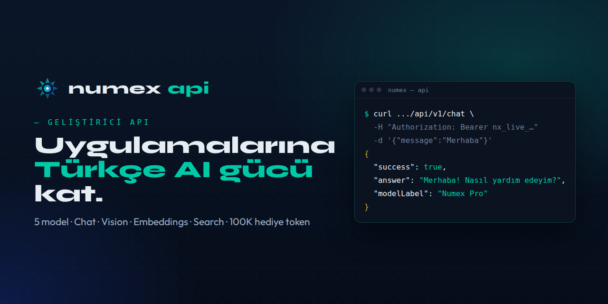

<div align="center">



# Numex API

### Uygulamalarına Türkçe AI gücü kat.

**Tek API ile sohbet, kod, görsel analiz, embedding ve web araması — Türkçe'ye özel.**

[](https://www.numexai.com.tr/api)
[](https://www.numexai.com.tr/api)
[](https://github.com/mobilcep/numex-sdk)

🇹🇷 Türkçe · [🇬🇧 English](README.en.md)

</div>

---

Numex API; [Numex AI](https://numexai.com.tr)'ın Türkçe'ye özel **Pipeline** motorundan geçen
modellerini kendi uygulamana bağlamanın yoludur. Ham bir model sarmalayıcısı değil: her yanıt Türkçe
düzeltme, ton ve kalite kontrol katmanlarından geçer.

> 📌 Bu depo Numex API'nin **dokümantasyon, örnek kod ve topluluk** deposudur.
> Anahtar almak için: [numexai.com.tr/api](https://www.numexai.com.tr/api).

## 📑 İçindekiler

- [Hızlı başlangıç](#-hızlı-başlangıç)
- [Kimlik doğrulama](#-kimlik-doğrulama)
- [Modeller](#-modeller)
- [Uç noktalar](#-uç-noktalar)
- [Fiyatlandırma](#-fiyatlandırma)
- [Kullanım limitleri](#-kullanım-limitleri)
- [Hatalar](#️-hatalar)
- [SDK ve örnekler](#-sdk-ve-örnekler)
- [Destek](#-destek)

---

## ⚡ Hızlı başlangıç

**1.** [numexai.com.tr/api](https://www.numexai.com.tr/api) → **Ücretsiz API Anahtarı Al**
(Google/GitHub ile giriş; ilk kayıtta **100.000 token** hediye, kart gerekmez).

**2.** Anahtarını kopyala. `nx_live_` ile başlar ve **yalnızca bir kez** gösterilir.

**3.** İlk isteğini at:

```bash
curl https://www.numexai.com.tr/api/v1/chat \
  -H "Authorization: Bearer $NUMEX_API_KEY" \
  -H "Content-Type: application/json" \
  -d '{"message":"Merhaba, nasılsın?","history":[],"maxOutputTokens":512}'
```

```json
{
  "success": true,
  "answer": "Merhaba! İyiyim, teşekkür ederim. Sana nasıl yardımcı olabilirim?",
  "modelProfile": "pro",
  "modelLabel": "Numex Pro",
  "usage": {
    "estimatedInputTokens": 5,
    "estimatedOutputTokens": 18,
    "estimatedTotalTokens": 23,
    "billedTokens": 23,
    "multiplier": 1
  }
}
```

<details>
<summary><b>Python</b></summary>

```python
import os, requests

r = requests.post(
    "https://www.numexai.com.tr/api/v1/chat",
    headers={"Authorization": f"Bearer {os.environ['NUMEX_API_KEY']}"},
    json={"message": "Python'da fibonacci fonksiyonu yaz", "history": [], "maxOutputTokens": 1024},
)
print(r.json().get("answer", ""))
```
</details>

<details>
<summary><b>JavaScript (fetch)</b></summary>

```javascript
const res = await fetch('https://www.numexai.com.tr/api/v1/chat', {
  method: 'POST',
  headers: {
    Authorization: `Bearer ${process.env.NUMEX_API_KEY}`,
    'Content-Type': 'application/json',
  },
  body: JSON.stringify({ message: 'React ile todo app yaz', history: [], maxOutputTokens: 2048 }),
});
const data = await res.json();
console.log(data.answer);
```
</details>

<details>
<summary><b>Node.js SDK</b></summary>

```bash
npm install numexcodex-sdk
```

```javascript
const { Numex } = require('numexcodex-sdk');
const numex = new Numex({
  apiKey: process.env.NUMEX_API_KEY,
  baseURL: 'https://www.numexai.com.tr/api/v1',
});
const r = await numex.chat.completions.create({
  messages: [{ role: 'user', content: 'Merhaba!' }],
});
console.log(r.answer);
```
→ [github.com/mobilcep/numex-sdk](https://github.com/mobilcep/numex-sdk)
</details>

Daha fazla hazır örnek: [`ornekler/`](ornekler/)

---

## 🔐 Kimlik doğrulama

İki başlıktan biri yeterli:

```http
Authorization: Bearer nx_live_...
```
```http
x-api-key: nx_live_...
```

- Anahtarı **sunucunda** sakla; tarayıcı koduna, mobil uygulamaya ya da herkese açık depoya koyma.
- Panelden anahtarı **döndürebilir** (rotate), devre dışı bırakabilir ya da silebilirsin.
- Anahtar yoksa: `401 {"error":"x-api-key zorunludur","code":"missing_api_key"}`

---

## 🧠 Modeller

| Model | Rol | Bağlam | Maks. çıktı | Yetenekler | Input / 1M | Output / 1M |
|---|---|---|---|---|---|---|
| ⚡ `numex-pro` | **En popüler.** Akıl yürütme, yaratıcılık, Türkçe'de en yüksek başarım | 128K | 4K | Vision ✓ · Function calling ✓ | ₺30 | ₺250 |
| 🚀 `numex-fast` | Hız ve maliyet odaklı: günlük görevler, sınıflandırma | 32K | 4K | Vision ✓ · ~3× hızlı | ₺15 | ₺30 |
| 🧠 `numex-think` | Derin akıl yürütme: matematik, mantık, strateji | 128K | 8K | Chain-of-thought | ₺45 | ₺90 |
| 💻 `numex-code` | Kod: tamamlama, bug fix, review, refactor | 64K | 8K | 25+ programlama dili | ₺30 | ₺85 |
| 🖼️ `numex-vision` | Görsel anlama, resim açıklama, OCR | — | — | Image → Text · OCR · Türkçe | ₺100 / görsel analizi | — |

Model, istekte `model` (veya `modelProfile`) alanıyla seçilir. Kullanılabilen modeller planına göre
değişir; güncel liste için `GET /models`, açık yetenekler için `GET /features`.

---

## 📚 Uç noktalar

**Base URL:** `https://www.numexai.com.tr/api/v1`

| Yöntem | Yol | Açıklama | Ayrıntı |
|---|---|---|---|
| `POST` | `/chat` | Sohbet yanıtı | [→](docs/uc-noktalar.md#post-chat) |
| `POST` | `/chat/stream` | Akışlı sohbet (SSE) | [→](docs/uc-noktalar.md#post-chatstream) |
| `POST` | `/chat/agent` | Araç kullanan, çok adımlı ajan (function calling) | [→](docs/uc-noktalar.md#post-chatagent) |
| `POST` | `/vision` | Görsel analizi / OCR | [→](docs/uc-noktalar.md#post-vision) |
| `POST` | `/images/generations` | Görsel üretimi | [→](docs/uc-noktalar.md#post-imagesgenerations) |
| `POST` | `/embeddings` | Metin vektörleri (en fazla 128 metin) | [→](docs/uc-noktalar.md#post-embeddings) |
| `POST` | `/search` | Web araması + kaynaklar | [→](docs/uc-noktalar.md#post-search) |
| `GET` | `/models` | Modeller | [→](docs/uc-noktalar.md#get-models) |
| `GET` | `/features` | Hesabında açık yetenekler | [→](docs/uc-noktalar.md#get-features) |
| `GET` | `/usage` · `/usage/history` | Token kullanımı | [→](docs/uc-noktalar.md#hesap-ve-kullanım) |
| `GET` | `/me` · `/account` | Hesap ve bakiye | [→](docs/uc-noktalar.md#hesap-ve-kullanım) |

👉 **Tam referans: [docs/uc-noktalar.md](docs/uc-noktalar.md)**

---

## 💳 Fiyatlandırma

**Token paketleri — kullandıkça öde.** Numex uygulama aboneliğinden bağımsızdır. Tokenler
**kalıcıdır**: ay sonunda sıfırlanmaz, kullanmadıkça devreder. Her çağrıda yalnızca kullanılan token
bakiyeden düşer.

| Paket | Fiyat | Token | Yaklaşık | Öne çıkanlar |
|---|---|---|---|---|
| **Starter API** | ₺499 | 5.000.000 | ~2.500 sohbet mesajı · ~2 CLI projesi | Chat erişimi, kullanım metrikleri |
| **Growth API** ⭐ | ₺1.499 | 20.000.000 | ~10.000 mesaj · ~10 CLI projesi | Premium model havuzu, öncelikli kuyruk, aşım ₺0,10 / 1K |
| **Scale API** | ₺3.499 | 50.000.000 | ~25.000 mesaj · ~25 CLI projesi | Kurumsal destek & SLA, gelişmiş gözlemlenebilirlik, aşım ₺0,075 / 1K |

Model bazlı birim fiyatlar yukarıdaki [Modeller](#-modeller) tablosunda.
*Güncel fiyatlar için [numexai.com.tr/api](https://www.numexai.com.tr/api) esastır.*

## 🚦 Kullanım limitleri

Toplam harcaman arttıkça **tier**'in otomatik yükselir:

| Tier | İstek / dk | Token / dk | Günlük limit | Koşul |
|---|---|---|---|---|
| Free | 10 | 20K | 100K token | Ödeme bilgisi ekle |
| Tier 1 | 60 | 100K | Sınırsız | ₺250+ harcama |
| Tier 2 | 200 | 400K | Sınırsız | ₺2.500+ harcama |
| Tier 3 | 500 | 1M | Sınırsız | ₺10.000+ harcama |
| Enterprise | Özel | Özel | Sınırsız | İletişime geç |

## ⚠️ Hatalar

| Kod | Anlamı | Örnek gövde |
|---|---|---|
| `400` | Eksik / hatalı parametre | `{"error":"message zorunludur"}` |
| `401` | Anahtar yok veya geçersiz | `{"error":"x-api-key zorunludur","code":"missing_api_key"}` |
| `402` | Token bakiyesi yetersiz | `{"error":"Yetersiz token bakiyesi","code":"insufficient_tokens","tokenBalance":0}` |
| `429` | Hız limiti aşıldı | Bekleyip üstel geri çekilmeyle tekrar dene |
| `500` / `502` | Sunucu veya dış servis hatası | Kısa bir süre sonra tekrar dene |

---

## 🧰 SDK ve örnekler

| | |
|---|---|
| 🟩 **Node.js / TypeScript** | [numex-sdk](https://github.com/mobilcep/numex-sdk) — `npm i numexcodex-sdk` |
| 🐍 **Python** | Resmî SDK henüz yok; [`ornekler/python_sohbet.py`](ornekler/python_sohbet.py) |
| 🧪 **cURL** | [`ornekler/curl.sh`](ornekler/curl.sh) |
| ⌨️ **CLI** | [Numex Codex](https://github.com/mobilcep/numex-codex) — `npm i -g @numexai/cli` |

## 📬 Destek

- 📧 **destek@numexai.com.tr** — hafta içi 09:00–18:00
- 📞 **0216 311 53 58** — acil durumlar ve kurumsal, hafta içi 09:00–17:00
- 🤖 Numex sohbetinde *"destek"* yaz — 7/24
- 🐞 Dokümanda hata mı var? → [Issue aç](../../issues/new/choose)

<div align="center">

---

**Numex API** · [Numex Ailesi](https://www.numexai.com.tr/aile)'nin geliştirici kapısı · 🇹🇷

</div>
